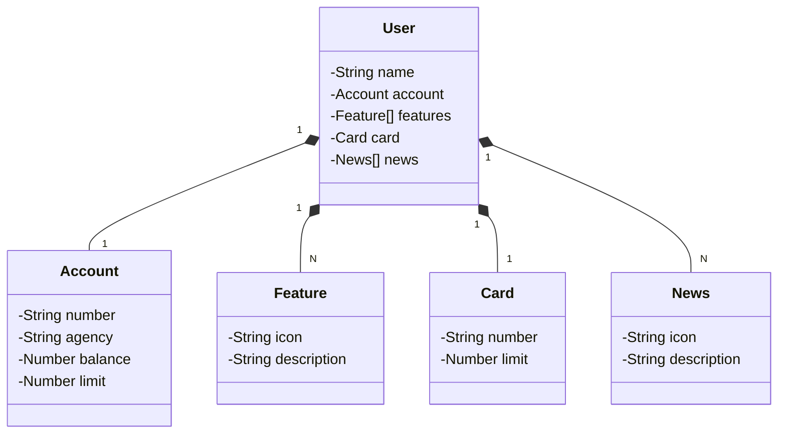

# Java RESTful API created during my DIO Fullstack Bootcamp.

## Main technologies
 - **Java 17**: Prefered using the latest LTS version of Java to take advantage of the latest innovations that this robust and widely used language offered.
 - **Spring Boot 3**: Worked with the newest version of Spring Boot, which maximized their productivity through its powerful auto-configuration premise.
 - **Spring Data JPA**: Explored how this tool simplified their data access layer, making it easier to integrate with SQL databases.
 - **OpenAPI (Swagger)**: Created an effective and easy-to-understand API documentation using OpenAPI (Swagger), perfectly aligned with the high productivity that Spring Boot provides.
 - **Railway**: It simplified the deployment and monitoring of their solutions in the cloud, and it offered various databases as a service and CI/CD pipelines.

## Class diagram (API Domain)

